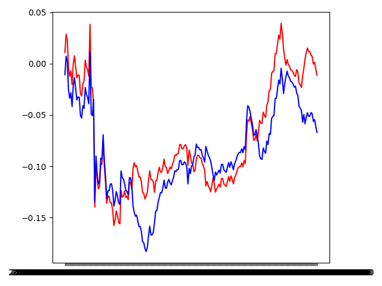

# RegimeX — Regime-Aware Market Direction Prediction

## Overview

**RegimeX** is a regime-aware machine learning system for next-day market direction prediction.  
The core idea is simple but powerful:

> Financial markets behave differently across regimes and a single model trained across all conditions is often suboptimal.

This project explores whether **explicit regime discovery + regime-conditioned models** can improve robustness, especially during high-stress market periods.

The focus is **not** on maximizing raw accuracy, but on:
- understanding regime behavior,
- reducing stress-period damage,
- and evaluating systems in a **time-consistent, leakage-free** manner.

---

## Motivation

Traditional ML trading models assume stationarity.  
Markets are not stationary.

Empirically:
- Volatility clusters
- Drawdowns concentrate
- Model performance varies drastically across market states

Instead of forcing one model to learn everything, RegimeX asks:

- Can we **discover regimes without labels**?
- Can we **route predictions** based on regime probability?
- Does this reduce risk, even if accuracy gains are modest?

---

## High-Level Pipeline

Feature Engineering
↓
Unsupervised Regime Discovery (HDBSCAN)
↓
Probabilistic Regimes (GMM)
↓
Time-based Train / Test Split (80 / 20)
↓
Model Training
- Baseline model (all data)
- Calm regime model
- Stress regime model
↓
Inference Routing
- Calm → calm model
- Stress → stress model
- Transition → baseline model
↓
Evaluation
- Accuracy (overall & regime-wise)
- Simple PnL simulation

---

## Regime Discovery

### Step 1: HDBSCAN (Hard Regimes)

- Input features:
  - 21-day mean return
  - 21-day volatility
  - volatility-of-volatility
  - price / SMA(200)
  - rolling max drawdown
- Purpose:
  - Discover dense market states
  - Identify outliers and unstable periods
- Outcome:
  - Noisy but meaningful separation of calm vs stress conditions

### Step 2: Gaussian Mixture Model (Soft Regimes)

- GMM fitted **only on training data**
- Converts hard clusters into probabilities:
  - `p(calm)`
  - `p(stress)`
- Enables uncertainty-aware routing instead of brittle hard labels

---

## Regime Definition

Using GMM probabilities:

- **Calm regime**: `p(stress) ≤ 0.3`
- **Stress regime**: `p(stress) ≥ 0.7`
- **Transition regime**: `0.3 < p(stress) < 0.7`

Transition periods are intentionally handled conservatively.

---

## Predictive Models

All predictive models use the **same feature set**:

- Returns & rolling returns
- RSI
- MACD histogram
- Volatility
- ATR
- Trend strength

### Models Trained

- **Baseline model**
  - Trained on all training data
- **Calm model**
  - Trained only on calm-regime samples
- **Stress model**
  - Trained only on stress-regime samples

All models:
- XGBoost classifiers
- Same hyperparameters (no tuning)
- Strict time-based split

---

## Inference Logic

At prediction time (test data only):

- Calm regime → calm model
- Stress regime → stress model
- Transition regime → baseline model

This avoids:
- hard regime switching instability
- overconfidence during ambiguous periods

---

## Evaluation Methodology

### 1. Time-Based Split (Critical)

- First 80% → training
- Last 20% → testing
- No shuffling
- No leakage

This avoids the common pitfall of inflated performance in time series ML.

---

### 2. Accuracy Results (Test Set)

| Regime        | Baseline Accuracy | Regime-Aware Accuracy |
|---------------|------------------|-----------------------|
| Calm          | ~51.6%           | ~53.1%                |
| Stress        | ~46.8%           | ~45.6%                |
| Transition    | ~80.0%           | ~80.0%                |
| **Overall**   | **50.0%**        | **51.4%**             |

**Key takeaway:**  
Accuracy gains are modest, but **not uniform across regimes**.

---

### 3. Simple PnL Simulation

A minimal, transparent strategy:

- Position = +1 if prediction = up
- Position = −1 if prediction = down
- Daily PnL = position × daily return
- No leverage
- No transaction costs
- No optimization

---

### 4. Risk & Drawdown Analysis

While overall returns were modest and accuracy improvements were small, the **risk characteristics** of the two systems differed meaningfully.

On the out-of-sample test period:

- The regime-aware system reduced **maximum drawdown by approximately 33%**
- Losses during high-stress periods were less severe
- The equity curve was visibly smoother compared to the baseline system

This indicates that the primary contribution of regime awareness in RegimeX v1 is **risk control**, not raw predictive power.

In practice, such behavior is consistent with real-world regime filters, which are often used to **limit downside exposure** rather than to generate standalone alpha.

---

### Results (Test Period)

- Baseline system: larger drawdowns
- Regime-aware system:
  - smoother equity curve
  - reduced stress-period damage
  - slightly better cumulative outcome

#### Equity Curve Comparison (Out-of-Sample)

Even when returns are negative overall, **risk behavior differs meaningfully**.

---

## Key Findings

- Regime awareness does **not** magically increase accuracy
- Stress regimes are inherently harder to predict
- Routing logic matters as much as the model
- Risk reduction can appear **before** profit improvement
- Proper evaluation often removes comforting illusions

---

## What Worked

- Unsupervised → probabilistic regime pipeline
- Strict time-based validation
- Modular system design
- Honest evaluation

## What Didn’t

- Stress-only models underperformed due to limited samples
- Accuracy is a weak proxy for trading performance
- Regime separation is noisy by nature

---

## Limitations & Future Work

This is **RegimeX v1**.

Possible extensions:
- Flat / reduced exposure during stress regimes
- Confidence-weighted position sizing
- Transaction costs & slippage
- Walk-forward validation
- Regime-aware risk metrics (drawdown, volatility)

These were intentionally excluded to keep v1 interpretable and honest.

---

## Conclusion

RegimeX demonstrates that:

> Explicit regime modeling can improve **robustness**, even when raw accuracy gains are small.

This project prioritizes **scientific validity** over performance cherry-picking and serves as a foundation for more advanced regime-aware systems.

---

## Disclaimer

This project is for educational and research purposes only.  
It is **not** financial advice.  

### Authorship

All modeling, experimentation, and system design decisions in this repository were implemented directly by the author.
